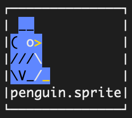

# glif
2d terminal game engine

## Demo

Run the ski demo:

```
go run ./demos/ski
```

Run the blackjack demo:

```
go run ./demos/blackjack
```

## Sprite assets

Masked sprites use three files with a shared base name:

- `<name>.sprite`
- `<name>.color`
- `<name>.palette` (optional)
- `<name>.collision` (optional)

If `<name>.palette` is missing, `default.palette` in the same folder is used.
If `<name>.collision` is missing, the sprite has no collision mask. Any non-space character in `.collision` is treated as collidable.

Load with:

```
assets.LoadSprite("path/to/name")
```

Palette colors support:
- Hex RGB (`#RRGGBB` or `#RGB`)
- Named colors supported by tcell

Example:

`penguin.sprite`:
```
 __
( o>
///\
\V_/_
```

`penguin.color`:
```
.xx..
xxwg.
xxxw.
xxxwg
```

`penguin.palette`:
```
// key fg bg [bold] [transparent]
x #000000  #4576f2
g gold #4576f2
y #aaaaaa #4576f2
w #ffffff #4576f2
```

`penguin.collision`:
```
.xx..
xxxx.
xxxx.
xxxxx
```

Here's the result as rendered by the preview util:



## UI palettes

Load a palette and fetch styles by key:

```
pal, err := palette.Load("path/to/ui.palette")
style, err := pal.Style('x')
```

## Render primitives

The renderer provides simple primitives for boxes and lines:

```
type RectOptions struct {
	VLine    rune
	HLine    rune
	TLCorner rune
	TRCorner rune
	BLCorner rune
	BRCorner rune
	Fill     bool
	FillRune rune
}

r.Rect(x, y, w, h, style)                         // outline (defaults to tcell box runes)
r.Rect(x, y, w, h, style, RectOptions{Fill: true}) // filled (no border)

type LineOptions struct {
	Rune rune
}

r.HLine(x, y, length, style)
r.VLine(x, y, length, style)
```

## Tile maps

Tile maps can be loaded from a text map and a tiles file:

```
tilemap.LoadFromFiles("path/to/level.map", "path/to/level.tiles")
```

Example `.tiles`:
```
~ water
. empty
```

Example `.map`:
```
~~~~..~~
~..~~..~
```

Sprite names in `.tiles` are base paths (same as `assets.LoadSprite`).

## Mask generator

Generate a color mask or collision mask from a sprite:

```
go run ./utils/genmask --color path/to/sprite.sprite
go run ./utils/genmask --collision path/to/sprite.sprite
go run ./utils/genmask --color --collision path/to/sprite.sprite
```

## Sprite preview

Preview one or more masked sprites in a grid with filenames and scroll using the arrow keys:

```
go run ./utils/spritepreview path/to/sprite1 path/to/sprite2
go run ./utils/spritepreview path/to/folder
```
