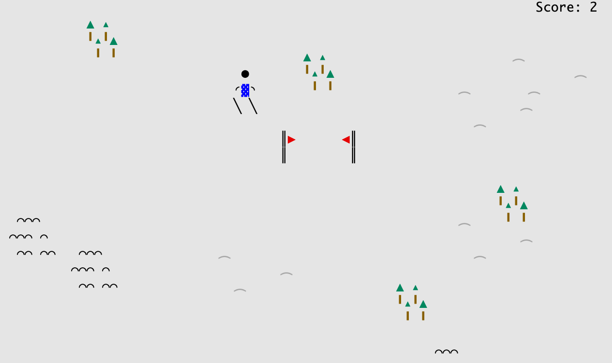
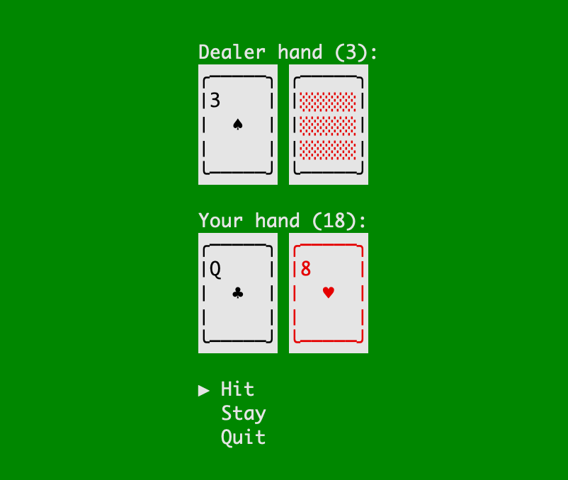

# glif
2d terminal game engine

## Demos

### Ski Demo

```
go run ./demos/ski
```



### Blackjack Demo

```
go run ./demos/blackjack
```



## Quickstart

Minimal loop that loads and draws a sprite:

```
package main

import (
	"log"

	"github.com/dgrundel/glif/assets"
	"github.com/dgrundel/glif/engine"
	"github.com/dgrundel/glif/input"
	"github.com/dgrundel/glif/render"
)

const (
	ActionQuit input.Action = "quit"
)

type Game struct {
	sprite *render.Sprite
	quit   bool
	actions input.ActionState
}

func (g *Game) Update(dt float64) {
	if g.actions.Pressed[ActionQuit] {
		g.quit = true
	}
}
func (g *Game) Resize(w, h int)           {}
func (g *Game) ShouldQuit() bool          { return g.quit }
func (g *Game) Draw(r *render.Renderer)   { r.DrawSprite(2, 2, g.sprite) }

func (g *Game) ActionMap() input.ActionMap {
	return input.ActionMap{
		ActionQuit: "key:esc",
	}
}

func (g *Game) UpdateActionState(state input.ActionState) {
	g.actions = state
}

func main() {
	game := &Game{sprite: assets.MustLoadSprite("path/to/sprite")}
	eng, err := engine.New(game, 0)
	if err != nil {
		log.Fatal(err)
	}
	if err := eng.Run(game); err != nil {
		log.Fatal(err)
	}
}
```

## Sprite assets

Masked sprites use files with a shared base name:

- `<name>.sprite`
- `<name>.color`
- `<name>.palette` (optional)
- `<name>.collision` (optional)

If `<name>.palette` is missing, `default.palette` in the same folder is used.
If `<name>.collision` is missing, the sprite has no collision mask. Space (` `) and dot (`.`) characters are treated as non-collidable. All other characters indicate collidable.

Load with:

```
assets.LoadSprite("path/to/name")
```

Palette colors support:
- Hex RGB (`#RRGGBB` or `#RGB`)
- Named colors supported by tcell

Example:

`penguin.sprite`:
```
 __
( o>
///\
\V_/_
```

`penguin.color`:
```
.xx..
xxwg.
xxxw.
xxxwg
```

`penguin.palette`:
```
// key fg bg [bold] [transparent]
x #000000  #4576f2
g gold #4576f2
y #aaaaaa #4576f2
w #ffffff #4576f2
```

`penguin.collision`:
```
.xx..
xxxx.
xxxx.
xxxxx
```

Here's the result as rendered by the preview util:


## Animation

Animations are stored in a separate file named `<base>.<name>.animation`. The width must match the base sprite, and the height must be a multiple of the base sprite height. Frames are stacked vertically.

Optional color masks:
- `<base>.<name>.animation.color` (stacked to match frame count)
- If missing, the base `.color` is repeated for all frames.

Load and play:
```
sprite, _ := assets.LoadSprite("path/to/player")
anim, _ := sprite.LoadAnimation("walk")
player := anim.Play(8) // fps
player.Update(dt)
frame := player.Sprite()
```

## Collision

If `<base>.collision` exists, any non-space character (and not `.`) is collidable. Use the collision API:

```
hit := collision.Overlaps(ax, ay, aSprite, bx, by, bSprite)
```

## Color palettes

Load a palette and fetch styles by key:

```
pal, err := palette.Load("path/to/ui.palette")
style, err := pal.Style('x')
```

## Render primitives

The renderer provides simple primitives for boxes and lines:

```
type RectOptions struct {
	VLine    rune
	HLine    rune
	TLCorner rune
	TRCorner rune
	BLCorner rune
	BRCorner rune
	Fill     bool
	FillRune rune
}

r.Rect(x, y, w, h, style)                         // outline (defaults to tcell box runes)
r.Rect(x, y, w, h, style, RectOptions{Fill: true}) // filled (no border)

type LineOptions struct {
	Rune rune
}

r.HLine(x, y, length, style)
r.VLine(x, y, length, style)
```

## Input

Input is delivered as per-frame state with `Pressed` and `Held` maps. Use an action map to keep key bindings out of game logic.

The engine can also pull action maps and push action state each frame:

```
type Game struct {
	actions input.ActionState
}

func (g *Game) ActionMap() input.ActionMap {
	return input.ActionMap{
		"quit": "key:esc",
	}
}

func (g *Game) UpdateActionState(state input.ActionState) {
	g.actions = state
}
```

## Engine timing

The engine uses a fixed timestep loop. When you pass `0` to `engine.New`, the default tick is ~60 FPS (16ms).

## Debug tips

- FPS overlay: `eng.ShowFPS = true`
- Sprite preview tool: `go run ./utils/spritepreview path/to/folder`

## Troubleshooting

- **Missing palette key**: update the palette or color mask to include the required key.
- **Sprite/color size mismatch**: ensure `.sprite` and `.color` have the same dimensions.
- **Collision size mismatch**: `.collision` must match the sprite dimensions.
- **Animation size mismatch**: animation width must match the base sprite width and height must be a multiple of the base sprite height.

## Tile maps

Tile maps can be loaded from a text map and a tiles file:

```
tilemap.LoadFromFiles("path/to/level.map", "path/to/level.tiles")
```

Example `.tiles`:
```
~ water
. empty
```

Example `.map`:
```
~~~~..~~
~..~~..~
```

Sprite names in `.tiles` are base paths (same as `assets.LoadSprite`).

## Mask generator

Generate a color mask or collision mask from a sprite:

```
go run ./utils/genmask --color path/to/sprite.sprite
go run ./utils/genmask --collision path/to/sprite.sprite
go run ./utils/genmask --color --collision path/to/sprite.sprite
```

## Sprite preview

Preview one or more masked sprites in a grid with filenames and scroll using the arrow keys:

```
go run ./utils/spritepreview path/to/sprite1 path/to/sprite2
go run ./utils/spritepreview path/to/folder
```
